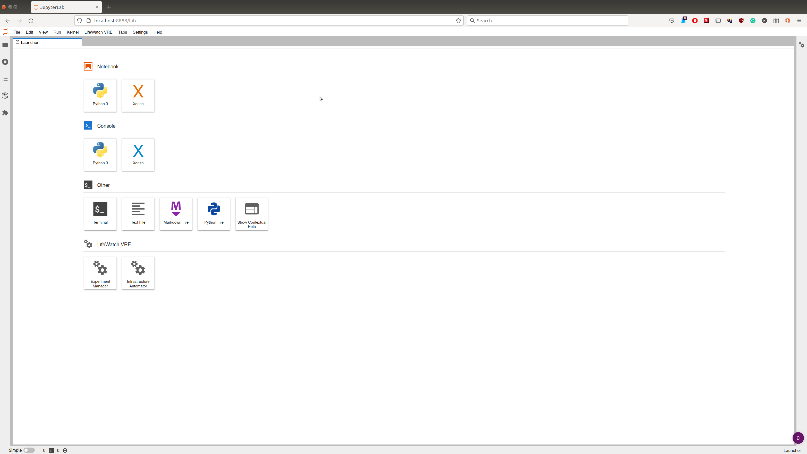
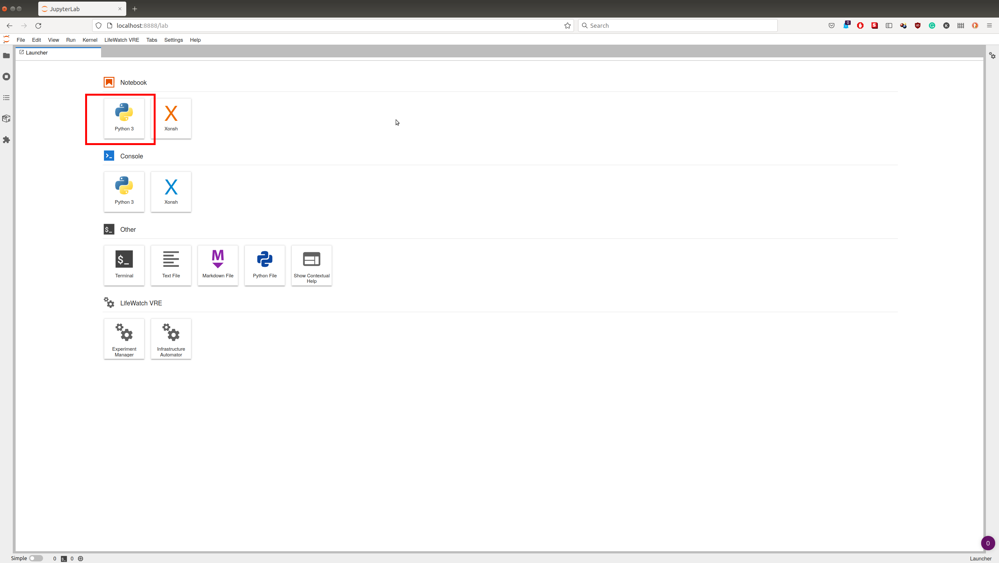

# FAIR-Cells

FAIR-Cells is a Jupyter Notebook extension that allows the user to interactively create a Docker image from a Jupyter Notebook. Our tool can be used to generate Docker images from single cells of a Jupyter Notebook. 

## Installation
Download the extention from: https://github.com/QCDIS/FAIRCells/blob/develop/jupyterlab_vre-1.0.0-py3-none-any.whl?raw=true
 
On the folder you saved the extention create a python virtual environment.  
```bash
python3 -m venv venv
source ./venv/bin/activate
```
Update pip and install the requirements 
```bash
pip install --upgrade pip
pip install wheel setuptools_rust
pip install jupyterlab_vre-1.0.0-py3-none-any.whl
jupyter lab build 
jupyter serverextension enable --py jupyterlab_vre --user

```
Start jupyter lab with:

```
jupyter lab 
```
You can now open http://localhost:8888 

## Getting stated  

When you start JupyterLab you'll see at the bottom the of the luncher page the LifeWatch VRE section 
<!--  -->


Start a new python notebook 


Create the following notebook: https://raw.githubusercontent.com/QCDIS/FAIRCells/master/simple_notebook.ipynb

Note that the coment in the beginig of each cell are importatnt. This is the name that will be given to each generated docker image  


