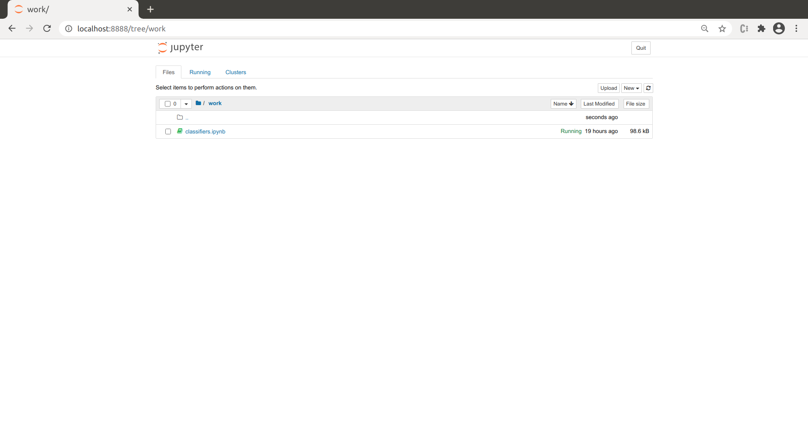
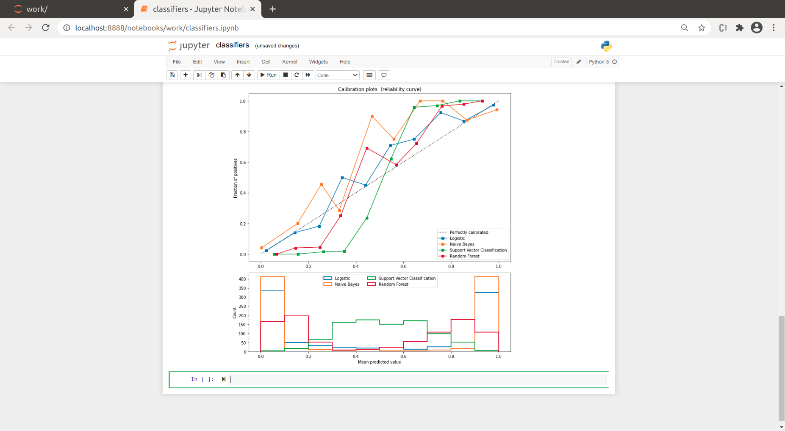
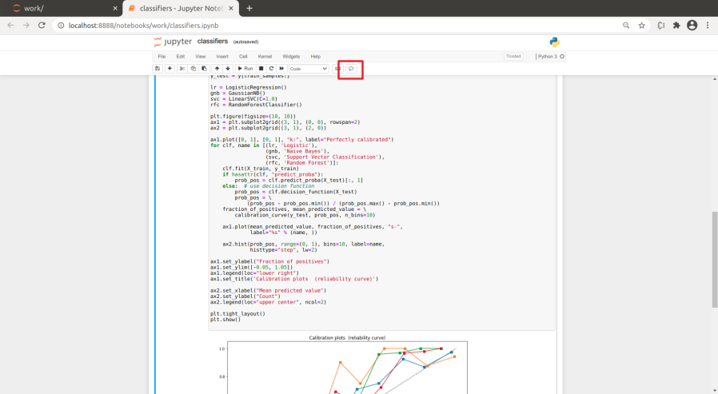
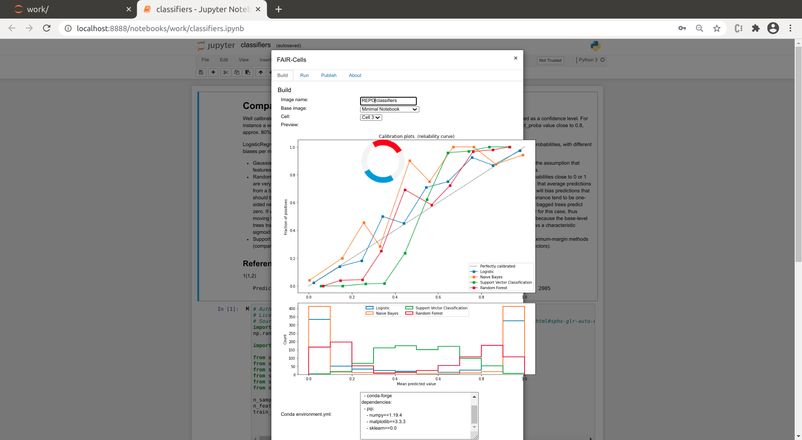
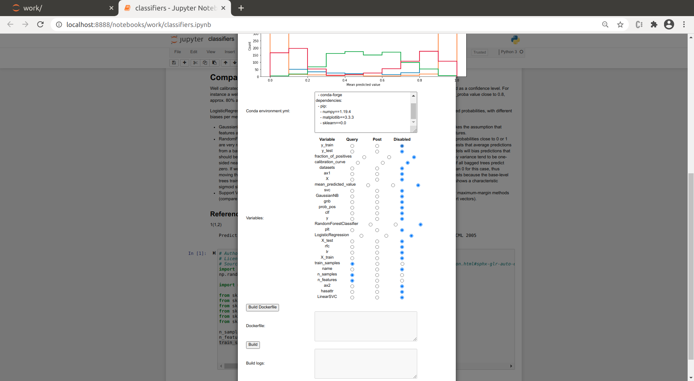
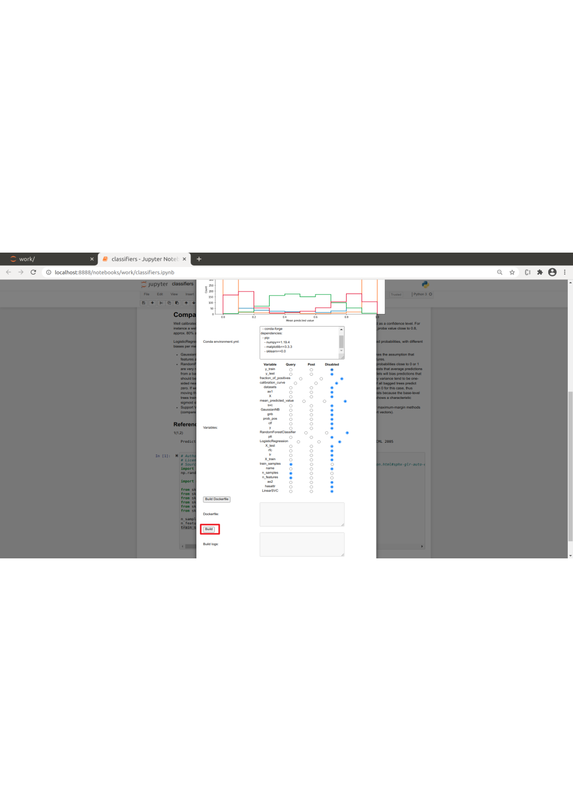
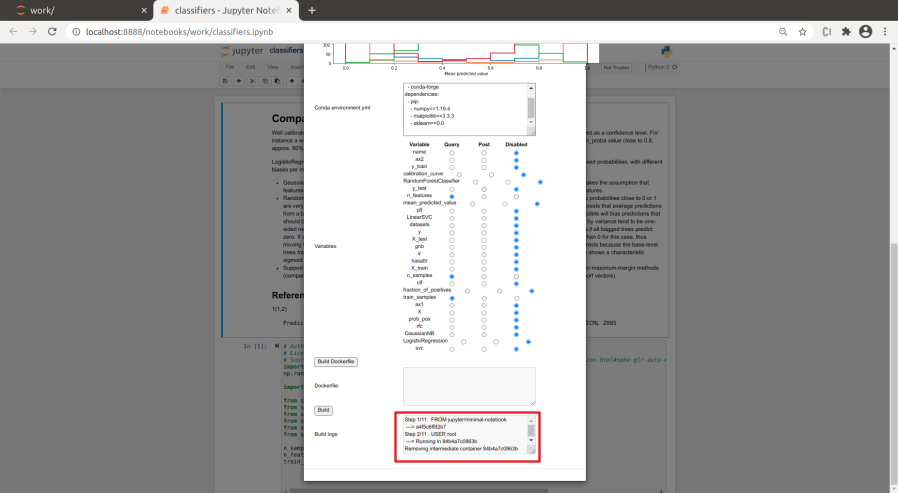
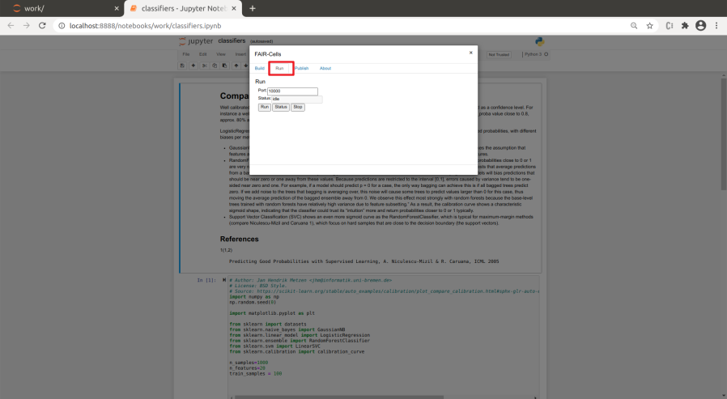
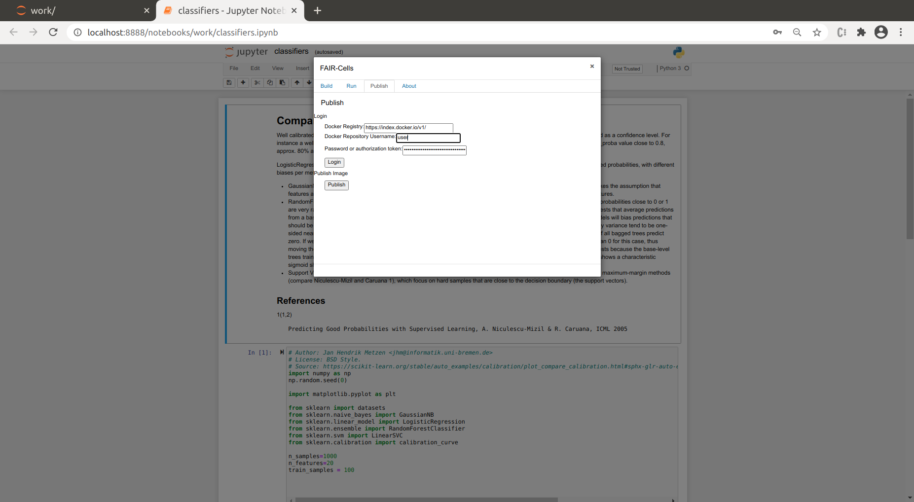
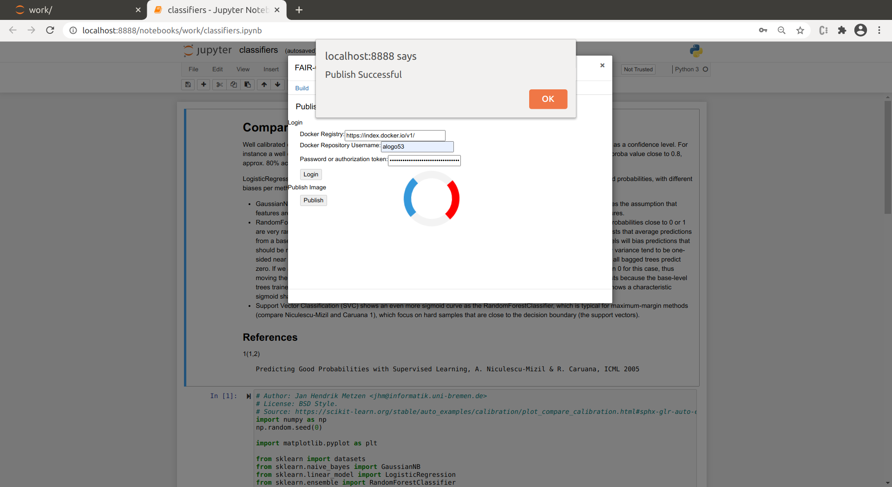

# FAIR-Cells

FAIR-Cells is a Jupyter Notebook extension that allows the user to interactively create a Docker image from a Jupyter Notebook. Our tool can be used to generate Docker images from single cells of a Jupyter Notebook. 

## Installation
Download the extention from: https://github.com/QCDIS/FAIRCells/blob/develop/jupyterlab_vre-1.0.0-py3-none-any.whl?raw=true
 
On the folder you saved the extention create a python virtual environment.  
```bash
python3 -m venv venv
source ./venv/bin/activate
```
Update pip and install the requirements 
```bash
pip install --upgrade pip
pip install wheel setuptools_rust
pip install jupyterlab_vre-1.0.0-py3-none-any.whl
jupyter lab build 
jupyter serverextension enable --py jupyterlab_vre --user

```
Start jupyter lab with:

```
jupyter lab 
```
You can now open http://localhost:8888 


## Getting stated  


### Start FAIR-Cells
Start the docker container with jupyter and FAIR-Cells enabled:
```bash
 [sudo] docker run -it -p 8888:8888  -v /var/run/docker.sock:/var/run/docker.sock qcdis/fair-cells:release-1.0.13-winter-school-20
```

With your browser (preferably chrome or chromium) open http://127.0.0.1:8888/. The 'work' folder of the Jupyter server 
should contain a notebook named 'classifiers.ipynb'




### Execute Notebook
Open the notebook. The first cell provides a description of the notebook. Execute all the cells you should see the 
results of each classifier's accuracy.


You may experiment with different values for 'n_samples', 'n_features' and 'train_samples'. You may notice that as you 
increase the values of 'n_samples', 'n_features' and 'train_samples' the cell execution is taking longer. Also, it would 
take a long time to manually adjust all values to find the optimal combination. 

### Dockerize Cell

We need 'dockerize' the 3rd cell, so we can use it as an independent service. To do that start FAIR-Cells by 
clicking on the last icon on the second row. 


Fill in the fields of FAIR-Cells as shown in the images bellow. Make sure that the in 'Image name' field has the form:
'REPO/NAME', where 'REPO' you should put your dockerhub username. In the 'NAME' you may add any name you like. 


Make sure you select the variables 'n_samples', 'n_features' and 'train_samples' as 'query', so we can change their 
values while calling the service. You may leve the rest as 'disabled'


Next you may press 'Build' to 'dockerize' the selected cell. This process should take approximately 5 minutes.


When the process is done you will see the log message on the text area next to the build button:


### Test Dockerized Cell
As soon as the cell has been 'dockerized' you may start it as a service by selecting the 'Run' tab:


Press the 'Run' button and as soon as the state changes to create open a new tab and fill in the address: 
http://localhost:10000/. This will call the cell with the 'n_samples', 'n_features' and 'train_samples' set to their 
default. If you want to change these values set the address to 
http://localhost:10000/?train_samples=1000&n_samples=100000&n_features=10 or any other integers. 

Go back to Jupyter and stop the service by pressing 'stop'


### Publish Dockerized Cell

Open the 'Publish' tab and fill in your username and Access Token and press 'Login'. 
If the login was successful you can press 'Publish'


