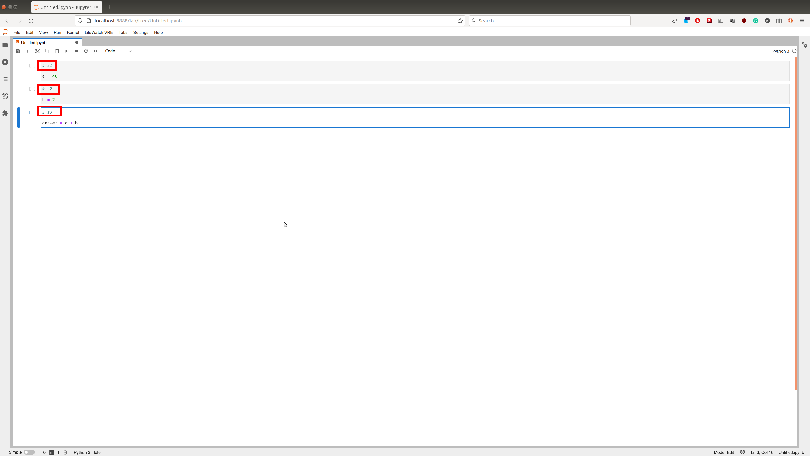
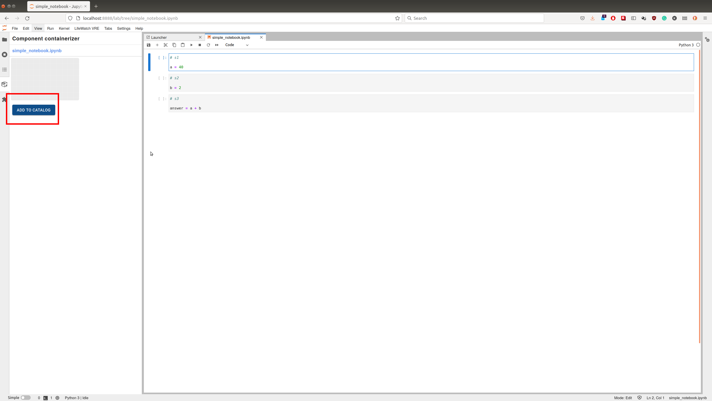

# FAIR-Cells

FAIR-Cells is a Jupyter Notebook extension that allows the user to interactively create a Docker image from a Jupyter Notebook. Our tool can be used to generate Docker images from single cells of a Jupyter Notebook. 

## Installation
Download the extention from
 
On the folder you saved the extention create a python virtual environment.  
```bash
python3 -m venv venv
source ./venv/bin/activate
```
Update pip and install the requirements 
```bash
pip install --upgrade pip
pip install wheel setuptools_rust
pip install jupyterlab_vre-1.0.0-py3-none-any.whl
jupyter lab build 
jupyter serverextension enable --py jupyterlab_vre --user

```
Start jupyter lab with:

```
jupyter lab 
```
You can now open http://localhost:8888 

## Getting stated  

When you start JupyterLab you'll see at the bottom the of the luncher page the LifeWatch VRE section 
<!--  -->


Start a new python notebook 
<!--  -->


Create the following notebook: https://raw.githubusercontent.com/QCDIS/FAIRCells/master/simple_notebook.ipynb

Note that the coment in the beginig of each cell are importatnt. This is the name that will be given to each generated docker image  
<!--  -->


Add your credentials for the Cloud Automator. To do that select from the top bar 'LifeWatch VRE'-> 'Manage Credential'


Select the containerization tool from the left tab 


Select the first cell and press 'ADD TO CATALOG'. This will start the process of containerizing the cell and push it to docker hub.


When this is done reapet the prcess for all of the cells. Each step takes aproximatlly 5 minutes.

From the lunacher open the experimant manager 


