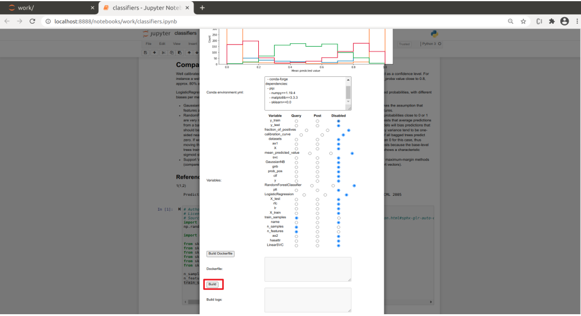

# FAIR-Cells

FAIR-Cells is a Jupyter Notebook extension that allows the user to interactively create a Docker image from a Jupyter Notebook. Our tool can be used to generate Docker images from single cells of a Jupyter Notebook. The generated image will run a web service that will output the specified cell. This includes image outputs like plots. Code introspection for Python enables the services to change cell output at service run-time.

 
 [](https://player.vimeo.com/video/478435713 "FAIR-Cells Demo")


Among other things, FAIR-Cells is useful for reusing notebook components in workflows that support web services. 

... More information to follow ...


## Installation
FAIR-Cells can be downloaded using pip. It then needs to be enabled using three Jupyter commands. Docker is required for the extension 
 to have any effect.
 
 Optionally, you may want to set up a virtual python environment:
 
```
$ python3 -m venv venv
$ source ./venv/bin/activate
```

```
$ pip install jupyter matplotlib docker fair-cells
$ jupyter serverextension enable --py fair-cells
$ jupyter nbextension install --py fair-cells --user
$ jupyter nbextension enable fair-cells --user --py

```
Start jupyter notebook with:

```
$ jupyter notebook
```
You can now open http://localhost:8888 

## Run with Docker
```
docker run -it -p 8888:8888  -e GEN_CERT=yes -v /var/run/docker.sock:/var/run/docker.sock qcdis/fair-cells 
```

## Development
To keep your system clean it is recommended to develop using Docker. The following command will run a Jupyter Notebook 
server with FAIR-Cells enabled at http://localhost:8888. Autoreload is enabled for Python files, you will need to reload 
your browser to see changes in the front-end.

```bash
$ docker-compose up --build main
```

To test the helper server that runs inside the container run the following command. This uses a dummy notebook that 
can be found in `docker/helper_dummy`. The notebook will be available at http://localhost:10000

```bash
$ docker-compose up --build helper
```


## Tutorial 

## Prerequisites 

Make sure you have Docker installed. To verify you may run:
```bash
$ [sudo] docker run hello-world
```

To be able to publish images to dockerhub you will need to create an account at https://registry.hub.docker.com/signup
As soon as you have created you account create an Access Token that you will use to publish images. To create an Access 
Token in dockerhub you may follow these instructions: https://docs.docker.com/docker-hub/access-tokens/ 


### Start FAIR-Cells
Start the docker container with jupyter and FAIR-Cells enabled:
```bash
 [sudo] docker run -it -p 8888:8888  -v /var/run/docker.sock:/var/run/docker.sock qcdis/fair-cells:release-1.0.13-winter-school-20
```

With your browser (preferably chrome or chromium) open http://127.0.0.1:8888/. The 'work' folder of the Jupyter server 
should contain a notebook named 'classifiers.ipynb'


### Execute Notebook
Open the notebook. The first cell provides a description of the notebook. Execute all the cells you should see the 
results of each classifier's accuracy.


You may experiment with different values for 'n_samples', 'n_features' and 'train_samples'. You may notice that as you 
increase the values of 'n_samples', 'n_features' and 'train_samples' the cell execution is taking longer. Also, it would 
take a long time to manually adjust all values to find the optimal combination. 

### Dockerize Cell

We need 'dockerize' the 3rd cell, so we can use it as an independent service. To do that start FAIR-Cells by 
clicking on the last icon on the second row. 


Fill in the fields of FAIR-Cells as shown in the images bellow. Make sure that the in 'Image name' field has the form:
'REPO/NAME', where 'REPO' you should put your dockerhub username. In the 'NAME' you may add any name you like. 


Make sure you select the variables 'n_samples', 'n_features' and 'train_samples' as 'query', so we can change their 
values while calling the service. You may leve the rest as 'disabled'


Next you may press 'Build' to 'dockerize' the selected cell. This process should take approximately 5 minutes.


When the process is done you will see the log message on the text area next to the build button:


### Test Dockerized Cell
As soon as the cell has been 'dockerized' you may start it as a service by selecting the 'Run' tab:


Press the 'Run' button and as soon as the state changes to create open a new tab and fill in the address: 
http://localhost:10000/. This will call the cell with the 'n_samples', 'n_features' and 'train_samples' set to their 
default. If you want to change these values set the address to 
http://localhost:10000/?train_samples=1000&n_samples=100000&n_features=10 or any other integers. 

Go back to Jupyter and stop the service by pressing 'stop'


### Publish Dockerized Cell

Open the 'Publish' tab and fill in your username and Access Token and press 'Login'. 
If the login was successful you can press 'Publish'


